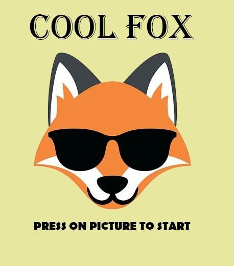

  

# CoolFox
Cool Fox is a side-scrolling 2d action game inspired from the well-known Super Mario game. The main character is a fox that wanders in the forest, trying to assemble as much food as he can in order to feed his family. This game is a one-player sprite-based game which is intended for desktop computers.

The game is intended for stand-alone PCs and only on the Windows platform, which uses either 64 bit or 32 bit
architecture. There are no specific system requirements for the game to be able to operate at its full capacity, as it is a simple indie
game intended for low-end PCs. Also, for the development of the game Unity engine was used. More specifically Unity’s 2d
engine version was used to develop and build the game with the preferred configurations.

Finally, there is also a Game Design Document available in this repository, which provides technical and non technical information about this game.
